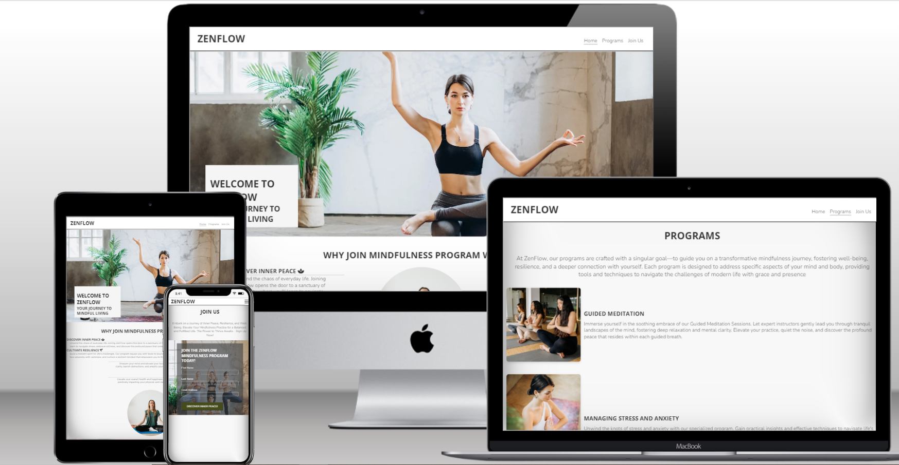
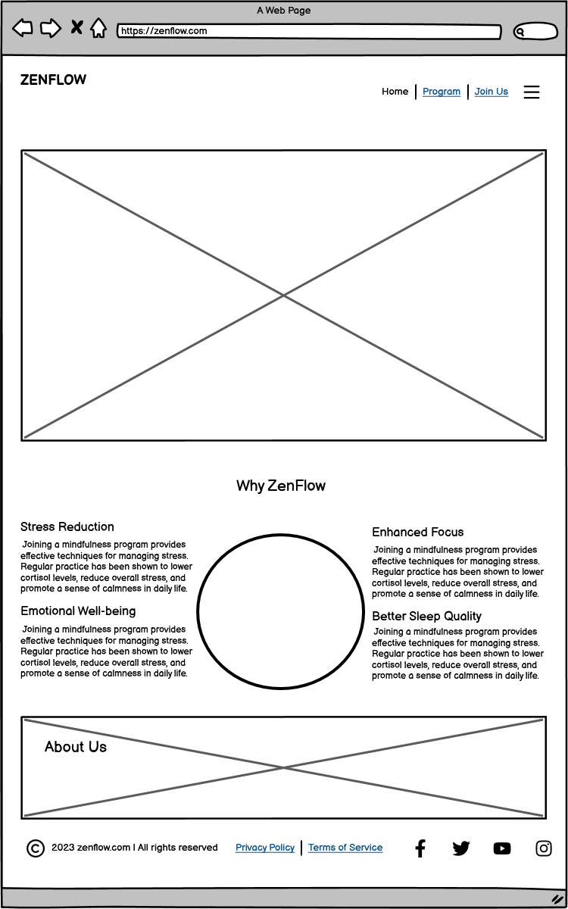
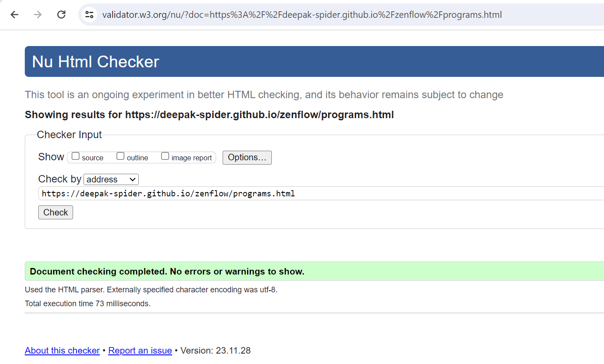
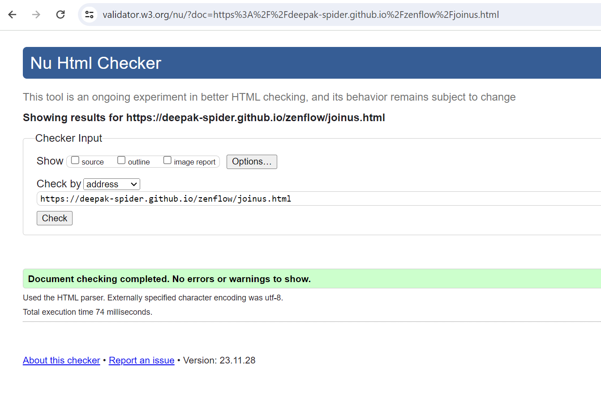

# **ZENFLOW - The Mindfulness Project**
ZenFlow, a transformative mindfulness project designed to empower individuals on their journey to well-being. The  primary objective of this project is to provide a platform that guides users through specific body/mind self-improvement techniques. From guided meditation sessions to stress management, this project aims to cultivate inner peace, enhance mental clarity, and foster a holistic sense of balance. The website also encourages visitors to take the next step in their mindfulness journey by becoming active members of the ZenFlow community. 

As part of the design, calming colors, easy navigation, and visually pleasing imagery have been incorporated, ensuring content is easy to access and the overall design promotes peace and tranquillity.

Visit ZenFlow's live site [here](https://deepak-spider.github.io/zenflow/)

# Contents

* [Objective](<#objective>)
* [User Experience](<#user-experience-ux>)
    * [Target Audience](<#target-audience>)
    * [User Stories](<#user-stories>)
    * [Site Aims](<#site-aims>)
    * [Design Wireframes](<#design-wireframes>)
    * [Site Structure](<#site-structure>)
    * [Design Choices](<#design-choices>)
    *   [Colour Scheme](<#colour-scheme>)
    *   [Typography](<#typography>)
* [Features](<#features>)
    * [Navigation Menu](<#navigation-menu>)
    * [Home Page](<#home-page>)
    * [Programs Page](<#programs-page>)
    * [Join Us Page](<#join-us-page>)
    * [Thank You Page](<#thank-you-page>)
    * [Footer](<#footer>)
* [Future Features](<#future-features>)
* [Technologies Used](<#technologies-used>)
* [Testing](<#testing>)
    * [Code Validation](<#code-validation>)
    * [Lighthouse Testing](<#lighthouse-testing>)
    * [Responsive Testing](<#responsive-testing>)
    * [Accessibility Testing](<#accessibility-testing>)
    * [Manual Testing](<#manual-testing>)
    * [Bugs Fixed](<#bugs-fixed>)
* [Deployment](<#deployment>)
* [Credits](<#credits>)
* [Acknowledgements](<#acknowledgements>)

# Objective

* The  primary objective of this project is to provide a platform that guides users through specific body/mind self-improvement techniques. 
* The website also encourages visitors to take the next step in their mindfulness journey by becoming active members of the ZenFlow community. 

[Back to top](<#contents>)

# User Experience (UX)

## Target Audience

ZenFlow is aimed at individuals looking for a path to self-improvement. Its target audience includes people seeking effective stress management, meditation enthusiasts, wellness and self-care advocates, sleep-deprived individuals looking for relaxation techniques, and yoga and Tai Chi practitioners seeking a synergistic approach to mindful movement.

## User Stories

* As a new visitor to the ZenFlow website, I want to be greeted by a visually captivating Hero image and a warm welcoming message that clearly communicates the purpose of the platform. I expect easy navigation with a responsive menu, allowing seamless access to key sections like Home, Programs, and Join Us. Scrolling down, I look forward to discovering compelling reasons to join a mindfulness program and gaining insights about ZenFlow through an engaging 'About Us' section. The footer should provide links to social media, creating a holistic and inviting user experience.

 * As a user exploring ZenFlow's Programs Page, I seek a clear heading and a brief yet informative description that highlights the overall purpose and benefits of the programs. Scrolling down, I anticipate discovering four distinct programs, each presented with concise information. As a potential participant, I'm eager to find a program that resonates with my goals for mindfulness and self-improvement.

* As a user interested in joining the ZenFlow mindfulness program, I navigate to the 'Join Us' page seeking a seamless and user-friendly experience. I expect a form  on the page, enticing me to share my details for ZenFlow to contact me for discussion. The submission process should be straightforward, allowing me to provide my information efficiently. Upon successful submission, I look forward to being redirected to a 'Thank You' page where I receive a warm and appreciative message from ZenFlow, assuring me that my interest is valued. The page should also provide information on what to expect next.

## Site Aims

* Provide users with the information and knowledge to empower themselves on their journey to well-being through mindfulness practices.
* Create an inclusive and user-friendly platform that makes mindfulness accessible to individuals at various stages of their mindfulness journey.
* Cultivate a community of like-minded individuals who share a common interest in mindfulness and well-being, fostering support and inspiration.
* Offer practical and actionable solutions to common challenges, such as stress, anxiety, and sleep issues, through expert-led mindfulness practices.
* Ensure a positive and seamless online experience for users, encouraging regular engagement and sustained mindfulness practice.

## Design Wireframes

The design and structure for this website was created in Balsamiq

## Site Structure

The ZenFlow website comprises three pages that users can easily navigate using the navigation bar and a thank you page that can only be accessed by submitting the contact form on the join us page . On the Home Page, which is the default loading page, there is a header with site branding featuring the logo positioned at the top left, which can be clicked to return to the Home Page. On the right-hand side, below the header, there are navigation links for Programs and Join Us page.

## Design Choices

### Colour Scheme

The website uses a mindful color palette that contributes to a comfortable and enjoyable browsing experience, aligning with the principles of mindfulness. 

Images used  are carefully chosen with nature-inspired neutrals and gently muted color palettes to create a calm, peaceful, and positive atmosphere, fostering a sense of serenity and harmony.

Logo (#333333 (Charcoal) and Text Color (#3A3A3A) (Calm Grays ) : Ensures optimal contrast for readability while maintaining a calming tone.

Call-to-Action Button (#454B1B) (Thatch Green): Draws attention to buttons, encouraging user interaction.

In summary, the color palette aims to create a visually soothing environment, aligning with the calming and transformative nature of mindfulness practices. It provides a good balance between professionalism and approachability. It also ensures sufficient contrast for accessibility and enhances the overall user experience and engagement.

### Typography
Heading font is Open Sans and Body Font is Nunito.
Open Sans and Nunito are both highly readable fonts. The boldness of Open Sans enhances visibility for headings and logo, while the regular weight of Nunito ensures comfortable reading for longer bodies of text. Both fonts have a clean and modern aesthetic, aligning with the principles of mindfulness that often emphasize simplicity and clarity.

[Back to top](<#contents>)

# Features

ZenFlow's website has been thoughtfully structured to offer users a smooth and intuitive experience across its three main pages. It's designed to be user-friendly and entice the user to explore further.
Each page, with the exception of the Home Page, features a heading. The program page provides a title for each program along with a brief description. The language, colors, and design are chosen to be approachable and easily comprehensible.

## Navigation Menu

A dynamic navigation menu ensures smooth navigation across the website. It adapts to different screen sizes, offering three variations for optimal user experience. The mobile navigation menu is a Hamburger button.

## Home Page

The homepage serves as the welcoming gateway to ZenFlow, enticing visitors with compelling reasons to embark on a mindfulness journey. 

The Home Page is the landing page of the website and the first part that the user will see. It is designed to be welcoming and the purpose of the website easily understood.The hero section features an aesthetically pleasing image associated with mindfulness. Overlaying the hero image is a welcome message with a catchy slogan.

The second fold section highlights the transformative benefits of joining the program and below that section is a brief introduction about ZenFlow's ethos and mission. The page seamlessly blends persuasive copy with captivating visuals, inviting users to explore the profound possibilities of mindful living.

Each section is fully responsive, with the multiple column content naturally falling into single column content.

## Programs Page

The second page delves into the heart of ZenFlow, offering an in-depth exploration of the diverse programs available. Each program, from Guided Meditation Sessions to Stress Management and Mindful Movement, provides a comprehensive overview of the transformative content awaiting those who choose to join ZenFlow.

## Join Us Page

The user should land on the Join Us page when looking to get in touch with the business.

The  contact form follows the standard layout, featuring three input fields: First Name, Last Name, and Email Address. Submission of the contact form is straight forward on correctly filling out the required fields.

Additionally, the form utilises a GET function to direct users to a Thank You page, simulating the form submission completion. It's important to note that no actual information is transmitted upon form completion, and the thank you page is purely illustrative of the user's interaction with the form.

## Thank You Page
The Thank You page isn't accessible through any links on the website. It is visible after submitting  the contact form on the Join Us  page, utilizing a GET function to retrieve the page and confirm the contact form submission.

## Footer

The footer, a constant presence across all pages, houses social media links. Facebook, Twitter, Youtube, and Instagram links that only connects to the home pages of the respective sites and are solely for educational purposes.

Overall, the website maintains a consistent style and design, featuring a sticky top navigation bar and a bottom footer, enables users to easily navigate back to the main website.

[Back to top](<#contents>)

# Future Features
A section featuring testimonials or success stories from users who have benefited from the ZenFlow mindfulness programs could be included in the Home page below the second fold. This  can inspire and build trust.

A blog page with mindfulness tips and insights offering quick mindfulness tips, quotes, or insights that visitors can easily absorb and apply in their daily lives can be included 

A section containing upcoming events or workshops section in the lower fold of programs page. Showcasing any upcoming live events, workshops, or webinars related to mindfulness that users might be interested in attending will increase user engagement. 

In the join us page, include a section highlighting  special offers, promotions, or discounts on membership or programs to encourage sign-ups.

## Technologies Used
* HTML5 - Delivers the structure and content for the website.
* CSS3 - Provides the styling for the website.
* [Gitpod](https://www.gitpod.io/) - Used to develop the website.
* [Github](https://github.com/) - Used to host and deploy the website.
* [Font Awesome](https://fontawesome.com/) for Icons.
* [Balsamiq](https://balsamiq.com/) for creating wireframes.
* [Canva](https://www.canva.com/) for image designing and resizing.
* [Adobe Color](https://color.adobe.com/) - To generate color palettes.
* [Convertio](https://convertio.co/png-webp/) to convert jpeg/png files to webp
* [Tiny PNG](https://tinypng.com/) - Used to further compress optimised images.
* [Experte](https://www.experte.com/accessibility/contrast) - Used to test the contrast and  Accessibility Testing.
* [Font Joy](https://fontjoy.com/) - for font pairing.
* [Techsini](https://techsini.com/multi-mockup/)- for multi device Website Mockup

# Testing
## Code Validation
ZenFlow website was sucessfully validated with the W3C HTML Validator and W3C CSS Validator. A minor error was identified on the homepage, swiftly rectified, and duly documented.
[Bugs Fixed](<#bugs-fixed>)

## Lighthouse Testing
The website underwent Lighthouse testing using Chrome DevTools, assessing it across four key areas: Performance, Accessibility, Best Practices, and SEO.

## Responsive Testing
Responsiveness was manually assessed across various mediums, with  Chrome DevTools and  [The Responsive Design Checker](https://responsivedesignchecker.com/) website.

## Accessibility Testing
An accessibility check for colour contrast on the website was conducted using EXPERTE.com, and it successfully met the required standards.

## Manual Testing
In addition to the automated process mentioned earlier, manual testing was also conducted on the site.
* Navigation Menu: Confirmed that all links direct to the correct pages without any broken links across all pages. Ensured that clicking the logo redirects to the Home Page. Validated the consistency of hover effects on all links. Checked and highlighted the active page. Verified the full responsiveness of the navigation bar.

* Home Page: Confirmed that the Hero image maintains clarity without pixelation and adapts well to different screen sizes. Ensured that all images on the home page are optimised. Verified the full responsiveness of all elements.

* Programs Page: Confirmed that all images are optimised and is with alt texts. Verified the full responsiveness of all elements.

* Contact Page: Confirmed that the contact form cannot be submitted unless essential information (First Name, Last Name, and Email Address) and right attributes are provided. Ensured that upon submitting the information via the contact form, the GET function functions correctly, retrieving the thank you page. Verified the full responsiveness of the page.

* Thank You Page: Confirmed the correct linking of the thank you page to the contact form. Ensured that the Thank You page exhibits full responsiveness.

* Footer: Confirmed that all social media links are correctly connected to their respective social media home pages. Ensured that clicking on any social media link opens a new tab.

## Bugs Fixed
The website testing through W3C HTML Validator revealed the following error and got it fixed.

## Deployment

Gitpod is the IDE used for development.

* Sign in to GitPod with the GitHub account.
* With the Gitpod IDE extension for Google Chrome, create a new workspace in GitPod.
* Click on the  green button “Gitpod” in the GitHub repository.
* On the GitPod dashboard, create a new workspace and it will take us to a fully functional IDE in the browser.
* IDE (Integrated Development Environment) interface has a file explorer on the left, code editor in the center, and a terminal at the bottom.
* On the left side, there is a file explorer where we can navigate through our project files and can create, delete, and organise files and folders here.
* The central area is the code editor where we write and edit code. Gitpod supports syntax highlighting, autocompletion, and other features depending on the file type.
* At the bottom, there is a terminal. This is the command line interface to interact with the workspace. We can run commands, install dependencies, and execute scripts here.
* Gitpod integrates seamlessly with version control systems like Git Hub. We can use the version control features directly from the IDE to add, commit, push, and manage branches.
* By running a command python3 -m http.server will Open Preview and Open Ports with a preview URL. We can access this in the browser to see our website in action.
* We can access the Gitpod dashboard to manage your workspaces, configure settings, etc.

The website has been deployed to GitHub pages using following steps:

* Go to the Settings tab in the GitHub repository for the project.
* On the left side, scroll down to the pages tab.
* In the Source tab, select the Main branch, and from the dropdown next to it, choose the Root folder.
* Save your changes.
* Once saved, the deployed link will appear at the top automatically.
* Deployment can take up to 5 minutes.

## Credits
* Fonts were sourced from [Google Fonts](https://fonts.google.com/)
* All images from the website were sourced from [Pexels](https://www.pexels.com/) and [Pixabay](https://pixabay.com/)
* Images were converted to webp with Convertio
* Colour palette was created by Adobe Color wheel
* Contrast of entire website was checked with Color Contrast Checker EXPERTE
* Flexbox system was learned via youtube video from Kevin Powell - Learn flexbox the easy way.
* Homepage design was inspired by the walkthrough project - Love Running.
* Icons in the footer were taken from Font Awesome
* The website referred for knowledge and information are - [Headspace](https://www.headspace.com/), [Calm](https://www.calm.com/), [Mindful.org](https://www.mindful.org/), [Insight Timer, UCLA Mindful Awareness Research Center (MARC)](https://www.uclahealth.org/programs/marc) 

## Acknowledgements

ZenFlow project was designed and developed in conjunction with the Full Stack Software Developer Diploma course at the Code Institute. I extend my gratitude to my mentor, cohort facilitator, fellow cohort members, the Slack community, and Code Institute for their invaluable support.

[Back to top](<#contents>)

